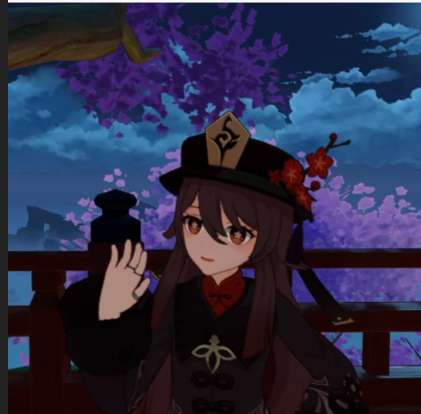

# 个人简历 CSS 样式设计实验报告

## 一、实验目的

1. 参考专业简历形式，为个人简历添加 CSS 样式，实现字体、颜色、边距、背景等基本样式
2. 将 CSS 样式单独写在.css 文件中，体会 CSS 的分离式控制能力
3. 使用合理的图片路径，确保图片可正常加载
4. 梳理并记录实验过程中的流程

## 二、实验流程

### 1. 分析参考简历布局

参考简历采用**左右两栏布局**：
- **左侧边栏**（深蓝色背景 #2c3e50）：包含照片、姓名、求职目标、联系方式、技能进度条、兴趣爱好
- **右侧主内容区**（白色背景）：包含教育背景、工作经历、项目经验、技能详情、自我评价

### 2. 创建文件结构

```
Report2/
├── report2.html          # HTML 文件
├── resume.css            # CSS 样式文件（新建）
├── R2_image/
│   └── image.png         # 个人照片
└── 实验报告.md           # 实验报告
```

### 3. 编写 CSS 样式文件

创建 `resume.css` 文件，包含以下样式模块：

#### (1) 全局样式重置
```css
* {
  margin: 0;
  padding: 0;
  box-sizing: border-box;
}
```

#### (2) 页面主体样式
```css
body {
  font-family: "Microsoft YaHei", Arial, sans-serif;
  line-height: 1.6;
  color: #333;
  background-color: #f0f0f0;
}
```

#### (3) 主容器布局（Flexbox 两栏布局）
```css
.container {
  display: flex;
  max-width: 1000px;
  margin: 20px auto;
  background-color: #fff;
  box-shadow: 0 0 20px rgba(0, 0, 0, 0.1);
}
```

#### (4) 左侧边栏样式
```css
.sidebar {
  width: 280px;
  background-color: #2c3e50;
  color: #fff;
  padding: 30px 20px;
  text-align: center;
}
```

#### (5) 右侧主内容区样式
```css
.main-content {
  flex: 1;
  padding: 30px;
  background-color: #fff;
}
```

#### (6) 照片样式
```css
.photo {
  width: 150px;
  height: 180px;
  margin: 0 auto 20px;
  border-radius: 8px;
  overflow: hidden;
  background-color: #fff;
  padding: 5px;
}

.photo img {
  width: 100%;
  height: 100%;
  object-fit: cover;
  border-radius: 5px;
}
```

#### (7) 技能进度条样式
```css
.skill-bar {
  height: 8px;
  background-color: #34495e;
  border-radius: 4px;
  overflow: hidden;
}

.skill-progress {
  height: 100%;
  background-color: #3498db;
  border-radius: 4px;
}
```

#### (8) 兴趣爱好网格布局
```css
.hobbies-grid {
  display: grid;
  grid-template-columns: repeat(2, 1fr);
  gap: 15px;
}
```

#### (9) 模块标题样式
```css
.section-title {
  font-size: 20px;
  font-weight: bold;
  color: #2c3e50;
  margin-bottom: 15px;
  padding-bottom: 8px;
  border-bottom: 2px solid #3498db;
  display: flex;
  align-items: center;
}
```

#### (10) 响应式设计
```css
@media screen and (max-width: 768px) {
  .container {
    flex-direction: column;
  }

  .sidebar {
    width: 100%;
  }

  .main-skills {
    grid-template-columns: 1fr;
  }
}
```

### 4. 修改 HTML 文件

- 移除 `<head>` 中的内联 `<style>` 标签
- 添加外部 CSS 文件引用：`<link rel="stylesheet" href="./resume.css">`
- 调整 HTML 结构为左右两栏布局：
  - 左侧：`<div class="sidebar">`（边栏）
  - 右侧：`<div class="main-content">`（主内容区）
- 添加技能进度条和兴趣爱好网格的 HTML 结构

### 5. 测试与调整

- 在浏览器中打开 HTML 文件，检查样式效果
- 调整颜色、边距、字体大小等细节
- 测试响应式布局效果

## 三、实验内容

### 1. 颜色方案

- **主色调**：深蓝色 (#2c3e50) - 用于左侧边栏背景
- **强调色**：蓝色 (#3498db) - 用于图标、进度条、标题边框
- **辅助色**：浅灰色 (#ecf0f1) - 用于边栏文字
- **背景色**：白色 (#fff) - 用于主内容区背景

### 2. 字体设置

- **字体家族**：Microsoft YaHei（微软雅黑）, Arial, sans-serif
- **姓名字体**：32px，加粗
- **模块标题**：20px，加粗
- **正文文本**：默认大小，行高 1.6-1.8

### 3. 布局设计

- **整体布局**：Flexbox 两栏布局
- **左侧边栏**：固定宽度 280px
- **右侧主内容区**：flex: 1（自适应剩余空间）
- **技能进度条**：使用百分比宽度表示熟练程度
- **兴趣爱好**：Grid 网格布局，2 列显示

### 4. 边距和间距

- **容器外边距**：20px auto（上下 20px，左右自动居中）
- **内边距**：30px（主内容区）
- **模块间距**：25px margin-bottom
- **列表项间距**：12px margin-bottom

### 5. 视觉效果

- **阴影效果**：box-shadow: 0 0 20px rgba(0, 0, 0, 0.1)
- **圆角效果**：border-radius: 4-8px
- **边框效果**：标题底部 2px 蓝色边框
- **悬停效果**：链接悬停时颜色变化

## 四、遇到的问题及解决方案

### 问题 1：CSS 文件未生效
- **问题描述**：修改 HTML 文件引用外部 CSS 后，样式没有生效
- **原因分析**：CSS 文件路径错误
- **解决方案**：检查文件路径，确保使用正确的相对路径 `./resume.css`

### 问题 2：Flexbox 布局不生效
- **问题描述**：左右两栏布局显示异常
- **原因分析**：容器没有设置 `display: flex`
- **解决方案**：为 `.container` 添加 `display: flex` 属性

### 问题 3：技能进度条宽度不一致
- **问题描述**：所有技能进度条宽度相同
- **原因分析**：没有为每个技能设置不同的宽度百分比
- **解决方案**：使用内联样式为每个技能设置不同的宽度，如 `style="width: 85%;"`

### 问题 4：响应式布局失效
- **问题描述**：在小屏幕上布局仍然保持两栏
- **原因分析**：缺少媒体查询或媒体查询条件不正确
- **解决方案**：添加 `@media screen and (max-width: 768px)` 媒体查询，在小屏幕时改为单栏布局

### 问题 5：图片加载失败
- **问题描述**：个人照片无法正常显示
- **原因分析**：图片路径不正确或图片文件不存在
- **解决方案**：确保图片文件存在于 `./R2_image/image.png` 路径下，或使用在线图片 URL

## 五、实验收获

### 1. 技术知识收获

- **CSS 分离式管理**：学会了将 CSS 样式写在独立的.css 文件中，通过`<link>`标签引入，提高了代码的可维护性
- **Flexbox 布局**：掌握了 Flexbox 两栏布局的实现方法，理解了 `display: flex`、`flex: 1` 等属性的用法
- **Grid 网格布局**：学会了使用 Grid 布局实现兴趣爱好的 2 列显示
- **响应式设计**：掌握了媒体查询的使用方法，能够为不同屏幕尺寸设计不同的布局
- **CSS 选择器**：熟练使用了类选择器、后代选择器等 CSS 选择器
- **颜色和背景**：学会了使用十六进制颜色代码、RGBA 颜色等设置颜色和背景

### 2. 实践能力提升

- **代码组织能力**：学会了将 CSS 样式按功能模块组织，提高代码可读性
- **调试能力**：通过浏览器开发者工具调试 CSS 样式，快速定位和解决问题
- **布局设计能力**：能够根据参考设计实现复杂的页面布局
- **细节处理能力**：注重边距、颜色、字体等细节，提升页面美观度

### 3. 对 CSS 控制能力的体会

- **分离式控制**：CSS 与 HTML 分离，便于维护和修改
- **层叠性**：理解了 CSS 的层叠特性，可以通过多个样式表控制同一元素
- **继承性**：某些 CSS 属性可以被子元素继承，减少重复代码
- **优先级**：理解了 CSS 选择器的优先级规则，内联样式 > ID 选择器 > 类选择器 > 标签选择器
- **盒子模型**：深入理解了 margin、border、padding、content 的关系

## 六、完整简历成果展示

### HTML 文件：report2.html

```html
<!DOCTYPE html>
<html lang="zh-CN">

<head>
  <meta charset="UTF-8">
  <meta name="viewport" content="width=device-width, initial-scale=1.0">
  <title>个人简历</title>
  <link rel="stylesheet" href="./resume.css">
  <link rel="stylesheet" href="https://cdnjs.cloudflare.com/ajax/libs/font-awesome/6.0.0/css/all.min.css">
</head>

<body>
  <div class="container">
    <!-- 左侧边栏 -->
    <div class="sidebar">
      <div class="photo">
        
      </div>
      
      <div class="name">杨宇航</div>
      <div class="job-title">求职目标：前端开发工程师</div>
      
      <ul class="contact-info">
        <li><i class="fas fa-user"></i>21 岁</li>
        <li><i class="fas fa-map-marker-alt"></i>江苏省连云港市</li>
        <li><i class="fas fa-phone"></i><a href="tel:18606150867">18606150867</a></li>
        <li><i class="fas fa-envelope"></i><a href="mailto:3859144827@qq.com">3859144827@qq.com</a></li>
      </ul>

      <div class="sidebar-skills">
        <h3>技能</h3>
        <div class="skill-item">
          <span>Java</span>
          <div class="skill-bar">
            <div class="skill-progress" style="width: 85%;"></div>
          </div>
        </div>
        <!-- 更多技能项... -->
      </div>

      <div class="sidebar-hobbies">
        <h3>兴趣爱好</h3>
        <div class="hobbies-grid">
          <div class="hobby-item">
            <i class="fas fa-basketball-ball"></i>
            <span>篮球</span>
          </div>
          <!-- 更多兴趣爱好... -->
        </div>
      </div>
    </div>

    <!-- 右侧主内容区 -->
    <div class="main-content">
      <div class="section">
        <div class="section-title"><i class="fas fa-graduation-cap"></i> 教育背景</div>
        <!-- 教育背景内容... -->
      </div>
      <!-- 更多模块... -->
    </div>
  </div>
</body>

</html>
```

### CSS 文件：resume.css

```css
/* 全局样式重置 */
* {
  margin: 0;
  padding: 0;
  box-sizing: border-box;
}

/* 页面主体样式 */
body {
  font-family: "Microsoft YaHei", Arial, sans-serif;
  line-height: 1.6;
  color: #333;
  background-color: #f0f0f0;
}

/* 主容器 - 采用 Flexbox 两栏布局 */
.container {
  display: flex;
  max-width: 1000px;
  margin: 20px auto;
  background-color: #fff;
  box-shadow: 0 0 20px rgba(0, 0, 0, 0.1);
}

/* 左侧边栏样式 */
.sidebar {
  width: 280px;
  background-color: #2c3e50;
  color: #fff;
  padding: 30px 20px;
  text-align: center;
}

/* 右侧主内容区样式 */
.main-content {
  flex: 1;
  padding: 30px;
  background-color: #fff;
}

/* 更多 CSS 样式... */
```

## 七、总结

本次实验成功完成了个人简历的 CSS 样式设计，实现了参考简历的左右两栏布局。通过将 CSS 样式写在独立的.css 文件中，体会到了 CSS 分离式管理的优势。实验过程中遇到了布局、样式、路径等问题，但通过仔细分析和调试，都成功解决了。

通过这次实验，我深入理解了 CSS 的字体、颜色、边距、背景等基本样式的控制方法，掌握了 Flexbox 和 Grid 布局的使用，学会了响应式设计的基本技巧。这些知识和技能为今后的前端开发学习打下了坚实的基础。
